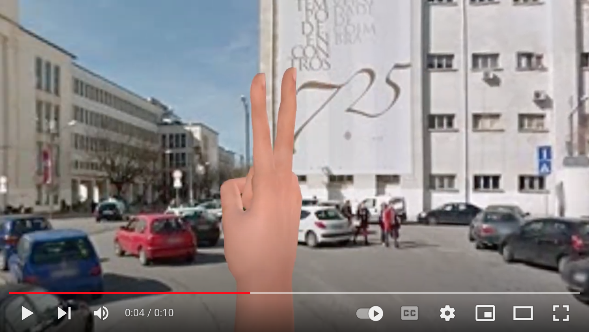
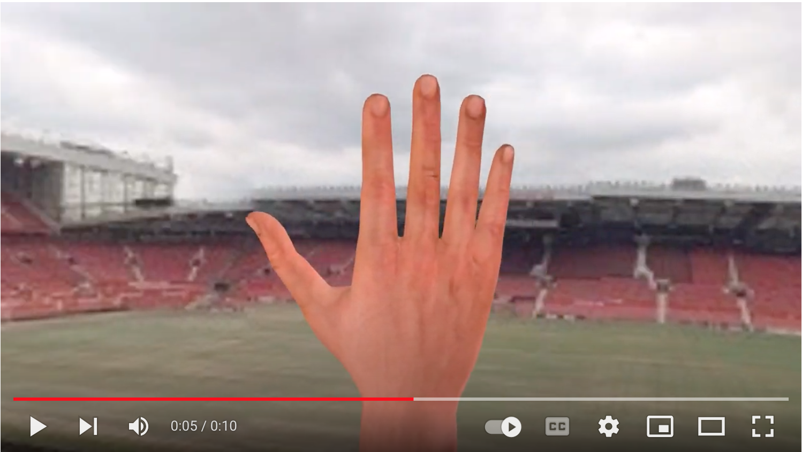

## Selected works in Machine Learning and Pattern Recognition

---

### PSO-Convolutional Neural Networks with Heterogeneous Learning Rate

The creation of a distributed collaborative learning framework for image classification is achieved through the introduction of a new approach known as Dynamics 1 and Dynamics 2. This innovative formulation integrates refined Cuckoo-Smale elements into the particle swarm optimization (PSO) algorithm, leveraging the power of K-Nearest Neighbors within convolutional neural networks (CNNs).

 
  

- H.P. Nguyen, A. Santos and B. Ribeiro, "PSO-Convolutional Neural Networks With Heterogeneous Learning Rate," in IEEE Access, vol. 10, pp. 89970-89988, 2022, doi: https://doi.org/10.1109/ACCESS.2022.3201142.

[View source code on Github](https://github.com/leonlha/PSO-ConvNet-Dynamics)

### Video Action Recognition Collaborative Learning with Dynamics via PSO-ConvNet Transformer

Extension of the distributed collaborative learning framework to address human action recognition by incorporating two sequence modeling techniques, namely RNN and Transformer. The effectiveness of this approach was validated in the challenging problem of Human Action Recognition (HAR).

Fig.1: A demonstration of the N(n,t) neighborhood, consisting of the positions of four closest particles and particle n itself, is shown. The velocities of the particles are depicted by arrows.

Fig.2: Rendering End-to-end ConvNet-Transformer Architecture.

Fig.3: Dynamic PSO-ConvNets System Design.

**Keywords**: Action Recognition, RNN, Transformer, CNN, PSO, Cucker-Smale, Distributed System, Collaborative Learning

[View source code on Github](https://github.com/leonlha/Video-Action-Recognition-Collaborative-Learning-with-Dynamics-via-PSO-ConvNet-Transformer)

### Advanced capsule networks via context awareness

The proposal involves enhancing Capsule Networks through the incorporation of additional Pooling layers to effectively filter out image backgrounds. Furthermore, the number of Reconstruction layers is increased to improve image restoration capabilities. This improved design aims to enhance the performance and accuracy of Capsule Networks in handling image data.

Fig.1: Vector Capsule Networks Architecture for ASL.

- H.P. Nguyen, B. Ribeiro (2019). Advanced Capsule Networks via Context Awareness. Artificial Neural Networks and Machine Learning – ICANN 2019: Theoretical Neural Computation. ICANN 2019. Lecture Notes in Computer Science(), vol 11727. Springer, Cham. https://doi.org/10.1007/978-3-030-30487-4_14

   

<video src="https://github.com/leonlha/portfolio/assets/48662637/4b6ca036-b35a-4293-a770-94a6378d2447" controls="controls" style="max-width: 100%;">
</video>

[View full video demo](http://bit.ly/2O4sJSU)

- [Bonus 3-D synthetic ASL digits dataset](https://github.com/leonlha/synthetic_asl_digits_3d/tree/master)

### Rethinking Recurrent Neural Networks and other Improvements for Image Classification

The proposal involves integrating a recurrent neural network (RNN) as an additional layer in the design of convolutional neural networks (CNN) for image recognition. By implementing end-to-end multi-model ensembles and extending the training strategy of the model, the developed approach achieves state-of-the-art performance. The results obtained demonstrate comparable or even superior performance compared to leading models on challenging datasets.

Fig.1: Single E2E-3M Model.

Fig.2: End-to-end Ensembles of Multiple Models: Concept and Design.

**Keywords**: Transfer Learning, Re-training, Test Time Augmentation (TTA), Ensemble Learning, Pruning

[View source code on Github](https://github.com/leonlha/e2e-3m)

### An Improvement for Capsule Networks Using Depthwise Separable Convolution

The proposal introduces a novel approach in the Capsule Networks architecture by replacing the Standard Convolution with a Depthwise Separable Convolution. This innovative design offers several benefits, including a substantial reduction in the total number of parameters in the model, improved stability, and competitive accuracy. The proposed modification aims to optimize the performance of Capsule Networks by leveraging the advantages of Depthwise Separable Convolutions.

Fig.1: Depthwise Separable Convolution Capsule Architecture.

- H.P. Nguyen, B. Ribeiro (2019). An Improvement for Capsule Networks Using Depthwise Separable Convolution. In: Morales, A., Fierrez, J., Sánchez, J., Ribeiro, B. (eds) Pattern Recognition and Image Analysis. IbPRIA 2019. Lecture Notes in Computer Science(), vol 11867. Springer, Cham. https://doi.org/10.1007/978-3-030-31332-6_45

**Keywords**: Capsule Networks, Depthwise Separable Convolution, CNN

### Context-Aware Capsule Networks

- H.P. Nguyen, B. Ribeiro (2019). Context-Aware Capsule Networks. Ciência 2019.

### Action Recognition for American Sign Language

Fig.1: ASL sequences of lion and cat signs

- H.P. Nguyen and B. Ribeiro. Action recognition for american sign language. In 24th Portuguese Conference on Pattern Recognition (RECPAD). RECPAD, 2018.

<video src="https://github.com/leonlha/portfolio/assets/48662637/702a3157-c9c7-4abb-a220-53e516be7d80" controls="controls" style="max-width: 100%;">
</video>

**Keywords**: Temporal Difference; Action Recognition; Deep Learning; Convolutional Neural Networks; ASL

### Offline and Online Deep Learning for Image Recognition

Fig.1: Comparisons of SGDs using Cifar-10 benchmark

- H.P. Nguyen and B. Ribeiro. Offine and online deep learning for image recognition. In 2017 4th Experiment@ International Conference (exp. at’17), pages 171–175. IEEE, 2017.

**Keywords**: Deep Learning; Convolutional Neural Networks; Image Recognition; Optimizers; SGD

## Other projects
A selection of other projects demonstrating specific skills.

---

### Marketing mobile apps for automotive industry

Fig.1: Toyota Mingalar Android App Screenshots

Fig.2: Mazda iPhone App Screenshots

Fig.3: Toyota Avanza Android App Screenshots

Fig.4: Mazda iPad App Screenshots

Fig.5: Laitang Japan Website Screenshots

- More (<a href="https://play.google.com/store/apps/developer?id=Ishida+Taiseisha+%28Thailand%29+Co.,+Ltd.&hl=en&gl=US">Play Store</a>, <a href="https://apps.apple.com/th/developer/itp-asia-company-limited/id977116686">App Store</a>), <a href="https://www.itp.co.th/web_app">Web apps and AR/VR.</a>

### Gnome X Scanning Microscopy
- Contribution made to the GXSM project on SourceForge: <a href="https://gxsm.sourceforge.net/">Scanning Probe Microscopy (SPM) and alike.</a>
